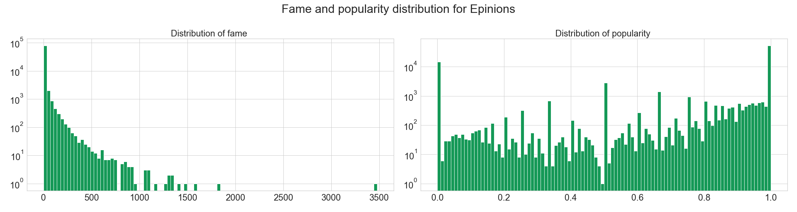

## Welcome to Adaptateur's Data Story

This work explore the general graph properties of three websites, [Epinions](https://shopping.com/), [Slashdot](https://slashdot.org/) and [Wikipedia](https://en.wikipedia.org/wiki/Main_Page).

More specifically, for both of theses social networks, links are explicitly positive or negative :
* The trust network of the Epinions product review Web site, where users can indicate their trust or distrust of the reviews of others
* The social network of the blog Slashdot, where a signed link indicates that one user likes or dislikes the comments of another
* The voting network of Wikipedia, where a signed link indicates a positive or negative vote by one user on the promotion to admin status of another

We propose to study the popularity of the users in social media and their like/dislike behaviour. For this purpose, we set to main axes, first we focus on the received votes, then we look at the voters behavior.

The github repo of our project is available [here](https://github.com/epfl-ada/ada-2020-project-milestone-p3-p3_adaptateur).

-----------------

## Popularity & fame : How a user is considered by other users ?

Let's start with some definitions ! \
**Fame**: the number of inner edges a user get positive and negative links. \
**Popularity**: the ratio of positive inner links a user received over the total inner edges.

----------

### Distribution

Now that we have this definitions, we can ask ourselves how fame and popularity are distributed over the three aforementioned websites.

Note that Wikipedia not having the same voting process than the two other website is here visible in the distributions.  For Slashdot and Epinions, we observe a power law distribution while for Wikipedia the distribution seems to follow a linear trend over a logorithm scales.  

Indeed, Shashdot and Epinions work as classical social media, where people who would like to be famous follow and vote for famous people. This phenomenon correspond to the social media theory in data science. However Wikipedia voting system is intern to administrator network. The network is structured differently because administrators vote in a more rationnal way.

The high number of user with popularity 0 and 1 with the high number of users with fame close to 0 correspond likely to people which received low number of votes (low fame) with popularity of 0 of it received a negative link and a popularity of 1 if the it received positive link. 

[//]: # (Expliquer comment fonctionne le principe de vote sur les sites -> Epinions/Slashdot vs Wikipedia -> Intro ?)

-----------------

### Are popularity and fame linked ?
Or could one be super famous but hated ? Like a despotic tyrant ?

As before, we denote a difference between Wikipedia, where most famous users are not necessarly the one with the highest popularity, and the two other websites where . Hence there is no despotic tyrant... or at least they are not using one of these websites !

-----------------

### Evolution over time
How did the overall popularity within a website evolved ? \
Unfortunately, Slashdot dataset did not record the time of the votes so we based our time analysis only on Wikipedia and Epinions. Let's first focus on the evolution of popularity for these two datasets.

* Wikipedia: note and important irregularity without trends and an average of about 78% popularity
* Epininons: 

The 

TODO

---------------

### Evolution of the most famous / popular ursers.

Here we focus our attention only on the 50 most famous subjects and observe the evolution of their popularity along with the evolution of their fame. Unfortunately, we cannot really comme to the conclusion of a pattern, except that most users do not have a constent popularity over time. For Epinions, many of them seem to loose popularity as they become more famous, but this is not a generality.

For Wikipedia, note that we have mostly lines, which could seem strange. This is due to Wikipedia's voting system, it works with election day and therefore this graph does not really give meaningfull informations.

---------------

## Haters & lovers : How users interact with each others ?

Once again, some useful definitions : \
**activity**: the total number of reviews a user performed. \
**hater/lover**: the ratio of positive outer links a user send over the total outer edges. A ratio close to 1 means the user is more of a "hater" and a ratio close to 0 indicates a "lover".

------------

### Distribution

First, let's take a look at the distribution for the activity and the hater/lover ratio on our favorite websites.

Here, we observe that the three websites seems to follow more or less a power law distribution for users activities. 
Since there is no differences, we can assume that the behavior does not depend on the website's purpose.

------------

## Puting it all together.

<!--  -->
<!--  -->
<!--  -->

For our three websites, we observe that most users have a low fame and low activity, then we either have users with high fame and low activity or the other way around.
Finaly, for Epinions, we observe a clear linearity between fame and activity.

------------

## It's time for some Machine Learning !

We are now ready to proceed and apply what we have learnt previously. Our new framework has created new features that can be used to predict the next vote. 
Several models were tested depending on which point of views we are interested in. Are popularity and fame sufficient for prediction ? Are activity and hate score sufficient for prediction ?  Or maybe a combination of all features could fit well our task. To perform the classification we choose two different models: Gradient Boosting classifier compare to a Logistic regression. As usual the GBC performs better than the Logistic Regression. Therefore we decided to show you the GBC results only using Bootstrap  a 95% Confidence interval and we empirically retrieve important features:

Model 1: Fame/Popularity point of view

| Dataset      | Accuracy | Important Features    | CI (95%) |
| :------------- | :----------: | -----------: |  -----------: |
| Wikipedia | 78,9% |    Popularity of receiver | [0.785, 0.793] |
| Epinions | 87,9% | Popularity of receiver | [0.878, 0.88] |

Model 2: Activity/Hater-score point of view

| Dataset      | Accuracy | Important Features    | CI (95%) |
| :------------- | :----------: | -----------: | -----------: |
| Wikipedia |  80,3% |   Hate-score of voter, Activity of receiver | [0.8, 0.807] |
| Epinions | 88,3% | Hate-score of voter | [0.882, 0.884] |

Model 3: General point of view

| Dataset      | Accuracy | Important Features    | CI (95%) |
| :------------- | :----------: | -----------: | -----------: |
| Wikipedia |  80,7% |  Hate-score of voter, Activity of receiver | [0.804, 0.81] |
| Epinions | 88,9% | Popularity of receiver, Hate-score of voter | [0.889, 0.891] |

As a first result this model perform better than the others, votes' results seem to be a combination of the voter behaviors and the receiver characteristics. Our regression performs better on the Epinions dataset. Indeed the two votes systems for each website is different. Wikipedia votings system is more professional and is less impacted by emotional behaviors while in a classical social media such as Epinions voters are not subject to vote rationally. Our features gives us more informations for such votes system.

Now we are interested in analysing the features importance of our model in a statically way over logistic regression. To avoid repeating ourselves, we choose a different approach for our analysis: we focus only on the nodes point of views. 

* Maybe only the combination of sender vote features could allow to predict the next vote ? This suppose that the voter does not take into account the receiver’s characteristics and his behavior is only determine by his voter mentality. 
* Maybe only the combination of receiver vote features could allow to predict the next vote ? This suppose the voter takes only into account receiver’s characteristic and his behavior is independent of his past votes. At the end we decide to create a general model that combine all features. 

-------

## Conclusion

Through this project, we first observe that **popularity and fame are linked** on our three websites, especially on Slashdot and Epinions, for which we can apply the classic media theory. However we noticed a difference for Wikipedia, due to the principle of the site and its functions. 
We also noticed that **users behaviors** are likely the same across the different platforms and do not depend on the website. 
Matching these two informations, we were able to link fame and activity and observe some matching between these features.
Finally, we apply some **Machine Learning** to try and predict the next vote depending on several features, and we managed to obtain a pretty good accuracy, especially for Epinions website. 
