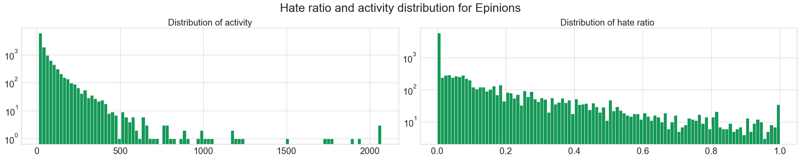

## Welcome to Adaptateur's Data Story

This work explore the general graph properties of three websites, [Epinions](https://shopping.com/), [Slashdot](https://slashdot.org/) and [Wikipedia](https://en.wikipedia.org/wiki/Main_Page).

More specifically, for both of theses social networks, links are explicitly positive or negative:
* The trust network of the Epinions product review Web site, where users can indicate their trust or distrust of the reviews of others
* The social network of the blog Slashdot, where a signed link indicates that one user likes or dislikes the comments of another
* The voting network of Wikipedia, where a signed link indicates a positive or negative vote by one user on the promotion to admin status of another

We propose to study the popularity of the users in social media and their like/dislike behaviour. For this purpose, we set two main axes, first we focus on the received votes, then we look at the voters behavior. At the end, we will have a look at both sides together, and try to understand what influences the sign of a link.

The github repo of our project is available [here](https://github.com/epfl-ada/ada-2020-project-milestone-p3-p3_adaptateur). This work is an extension to the analysis from [Signed Networks in Social Media](https://dl.acm.org/doi/abs/10.1145/1753326.1753532) [1].

[1] Leskovec, J., Huttenlocher, D., & Kleinberg, J. (2010, April). Signed networks in social media. In *Proceedings of the SIGCHI conference on human factors in computing systems* (pp. 1361-1370).

-----------------

## Popularity & fame: How a user is considered by other users?

Let's start with some definitions! 

* **Fame**: the total number of inner links a user receives. Both positive and negative links. This represents how many users expressed their opinion on this user.
* **Popularity**: the ratio of positive inner links a user received over the total inner edges. A popularity ratio should be thought of as follows: close to 0 means low popularity (nobody reallly "likes" the) while one close to 1 means high popularity (everybody "likes" them).

----------

### Distribution

Now that we have these definitions, we can ask ourselves how fame and popularity are distributed over the three aforementioned websites.

Note that Wikipedia not having the same voting process than the two other websites is here visible in the distributions.  For Slashdot and Epinions, we observe a power law distribution while for Wikipedia the distribution seems to follow a linear trend over a logorithm scales.  

Indeed, Shashdot and Epinions work as classical social media, where people who would like to be famous follow and vote for famous people. This phenomenon corresponds to the social media theory in data science. However, Wikipedia's voting system is internal to administrators of the network. The network is structured differently because administrators vote in a more rationnal way.

The high number of users with popularity 0 and 1 and the high number of users with fame close to 0 correspond likely to people who received low number of votes (low fame) with popularity of 0 if it received a negative link and a popularity of 1 if it received a positive link. 

-----------------

### Evolution over time
How did the overall popularity within a website evolved? \
Unfortunately, Slashdot dataset did not record the time of the votes so we based our time analysis only on Wikipedia and Epinions. Let's first focus on the evolution of popularity for these two datasets. More concretely, we will look at the ratio of positive edges on the network over time. We call this ratio "positivity".

* Wikipedia: an important irregularity without trends and an average of about 78% popularity
* Epininions: a linear downwarding evolution of the positivity starting from the 05/2001 staying over 85%

Once again the structural difference of the voting systems can easily be seen between these two graphs. Besides Wikipedia used to get some jumps because each election creates a batch of results for the same time. Globally, Wikipedia average popularity is lower than the one of Epinions. This also could result from the voting systems: Wikipedia voters will less try to valorized someone else by interest, they should vote rationally to makes the Wikipedia network the most responsible for everyone. Epinions  knew a hype at the beginning then user popularities progressively decrease. 

Notice that for the first 5 months, Epinions got a stable and high positive popularity average and Wikipedia knew chaotique schema until the 01/2005 where popularity becomes more stable around 80%. This periods could correspond to the beginning of the voting systems where people are not so famous, meaning with low number of votes for them. 

The downfall of positivity over time, mainly on Epinions and slightly on Wikipedia also shows that users were more and more exigeant over time. As the site grows, they got more critical. We could also postulate that the growth of the site attracted different users, who were more criticals.

We saw earlier the distribution of fame and popularity over the whole networks. Let's have a look at how the evolved over time.

First, we see that Epinions' distributions was pretty stable, with the fame distrribution keeping the same shape, but getting higher values.

However, for Wikipedia, the evolution is more interesting. At the beggining, the fame was shared more equally amongst the users, and popularity was much more positive.

---------------

### Evolution of the most famous / popular ursers.

Here we focus our attention only on the 50 most famous subjects and observe the evolution of their popularity along with the evolution of their fame. Unfortunately, we cannot really come to the conclusion of a pattern, except that most users do not have a constent popularity over time. For Epinions, many of them seem to loose popularity as they become more famous, but this is not a generality. This could be explained by people being more critical and demanding of famous users.

For Wikipedia, note that we have mostly lines, which could seem strange. This is due to Wikipedia's voting system, it works with election day and therefore this graph does not really give meaningfull informations. So this graph doese not really make sense in the case of Wikipedia, but it's nicer to visualize why :) 

---------------

## Haters & lovers: How users interact with each others?

After focusing on the destination of the links, let's now look at the other side! We will focus on the sources.

Once again, some useful definitions: 

* **activity**: the total number of reviews a user performed. 
* **hater/lover**: the ratio of positive outer links a user sent over the total outer edges. Similarly to popularity, a ratio close to 1 means the user is more of a "hater" and a ratio close to 0 indicates a "lover". 

------------

### Distribution

First, let's take a look at the distribution for the activity and the hater/lover ratio on our favorite websites.

Here, we observe that the three websites seems to follow more or less a power law distribution for users activities. 
Since there is no differences, we can assume that the behavior does not depend on the website's purpose.

We see also that the hater ratio is mostly low, i.e. people tend to give more positive reviews/votes than bad ones. This is to be expected, given that we already saw Signed Networks in Social Media [1] that the networks had about 80% of positive edges. It is also nice to see that not too many people enjoy downvoting/giving bad reviews massively to others.

Once again, let's have a look at the evolution over time for Wikipedia and Epinions.

Unlike on the evolution of fame and popularity, we see here that Wikipedia gets its final shape quickly. The hate ratio is low from the beggining, and the activity follows a power law right away. 

Epinions is once again very stable, and its shape stays the same.

------------

## Puting it all together.

Our new features are very interesting taking apart but combining them together can give us an even better understanding of the users. Some can produce equilibrate proportion of activity against fame and some other could react complete differently. For this purpose we decided to plot the density of fame against activity. Along the different datasets, which profile is it possible to identify and could we retrieve some logic behind them?

For instance we can think about extreme case user classification: 

|   Ratio | Low Fame | High Fame |
| :------------- | :----------: | :-----------: | 
| **Low Activity** |   Shadow user  |   Passive user    |
| **High Activity** |     Actif user|  Whale user   |

<!--  -->
<!--  -->
<!--  -->

For our three websites, we observe that most users have a low fame and low activity. Independently of the dataset there are horizontal and vertical lines which correspond to Passive and Active users as mentioned in our classification. Passive users are people such as spectators that receive a lot of votes but are not involved in the voting systems. Actif users, on the other side, vote a lot without reciprocity. We have the confirmation here of our first result on the high proportion of shadow users which gravitate around the network. Besides the main part of lambda users is represented by the cloud present in each dataset. Whale users are quite rare and follow this general trend implied by the cloud.

* Wikipedia: we clearly notice an upward shift for fame which indicates user voters are most voted than they vote
* Slashdot: we see a very disperse cloud, which seem to indicate that any kind of users cohexist.
* Epinions: clearly observe a linearity between fame and activity.

------------

## It's time for some Machine Learning!

We are now ready to proceed and apply what we have learnt previously. Our new framework has created new features that we could try to use to predict the next vote.
We will introduce machine learning for that. Mostly because it's fun, but it seems to be a trend these last years, and we are very fashionable people, so here goes.

Several models were tested depending on which point of views we are interested in. Are popularity and fame sufficient for prediction? Are activity and hate score sufficient for prediction?  Or maybe a combination of all features could fit well our task. To perform the classification we choose two different models: Gradient Boosting classifier compared to a Logistic regression. As usual, the GBC performs better than the Logistic Regression. Therefore we decided to show you the GBC results only using Bootstrap at 95% Confidence interval and we empirically retrieve important features:

Model 1: Fame/Popularity point of view

| Dataset      | Accuracy | Important Features    | CI (95%) |
| :------------- | :----------: | :-----------: |  :-----------: |
| Wikipedia | 78,9% |    Popularity of receiver | [0.785, 0.793] |
| Epinions | 87,9% | Popularity of receiver | [0.878, 0.88] |

Model 2: Activity/Hater-score point of view

| Dataset      | Accuracy | Important Features    | CI (95%) |
| :------------- | :----------: | :-----------: | :-----------: |
| Wikipedia |  80,3% |   Hate-score of voter, Activity of receiver | [0.8, 0.807] |
| Epinions | 88,3% | Hate-score of voter | [0.882, 0.884] |

Model 3: General point of view

| Dataset      | Accuracy | Important Features    | CI (95%) |
| :------------- | :----------: | :-----------: | :-----------: |
| Wikipedia |  80,7% |  Hate-score of voter, Activity of receiver | [0.804, 0.81] |
| Epinions | 88,9% | Popularity of receiver, Hate-score of voter | [0.889, 0.891] |

As a first result, this model perform better than the others. Votes' results seem to be a combination of the voter behaviors and the receiver characteristics. Our regression performs better on the Epinions dataset. Indeed, the two votes systems for each website is different. Wikipedia's voting system is more professional and is less impacted by emotional behaviors while in a classical social media such as Epinions voters are not subject to vote rationally. Our features gives us more informations for such votes system.

Now we are interested in analysing the features importance of our model in a statical way over logistic regression. To avoid repeating ourselves, we choose a different approach for our analysis: we focus only on the nodes point of views. 

* Maybe only the combination of sender vote features could allow to predict the next vote? This implies that the voter does not take into account the receiver’s characteristics and its behavior is only determine by its voter mentality. 
* Maybe only the combination of receiver vote features could allow to predict the next vote? This implies that the voter takes only into account receiver’s characteristics and their behavior is independent of their past votes. At the end, we decided to create a general model that combine all features. 

The two plot above represents the standard error for each features we integrated into the General model. In Wikipedia framework the sign of the link is strongly determined by the Activity and the Fame of the receiver. This result confirms our hypothesis about the voter behaviour. Their votes are more determined by user characteristics, proposed for election and not about an intrinsic emotional behaviour. A user who is higly active is more likely to get positive votes. Interestingly, a "famous" user will gete negative votes. This could be because morer "famous" means more votes, which means more elections for them, which could mean that elections weeere tried but failed, and they retried again later.

On the other side, Epinions votes prediction is also determined by the activity and the fame of the voter. Once again inside a social media such as Epinions, the profile of the voter takes an important role in the voting decision. This time, the activity of both the source and the destination plays an immportant negative role. This means that active users are more demanding, and also all users are more demanding towards active users.

-------

## Conclusion

Through this project, we first observed that **popularity and fame are linked** on our three websites, especially on Slashdot and Epinions, for which we can apply the classic media theory. However, we noticed a difference for Wikipedia, due to the principle of the site and its functions. 
We also noticed that **users behaviors** are likely the same across the different platforms and do not depend on the website. 
Matching these two informations, we were able to link fame and activity and observe some matching between these features.
Finally, we apply some **Machine Learning** to try and predict the next vote depending on several features, and we managed to obtain a pretty good accuracy, especially for Epinions website. Votes could predicted using mostly the fame and activity of the sources and destinations.
